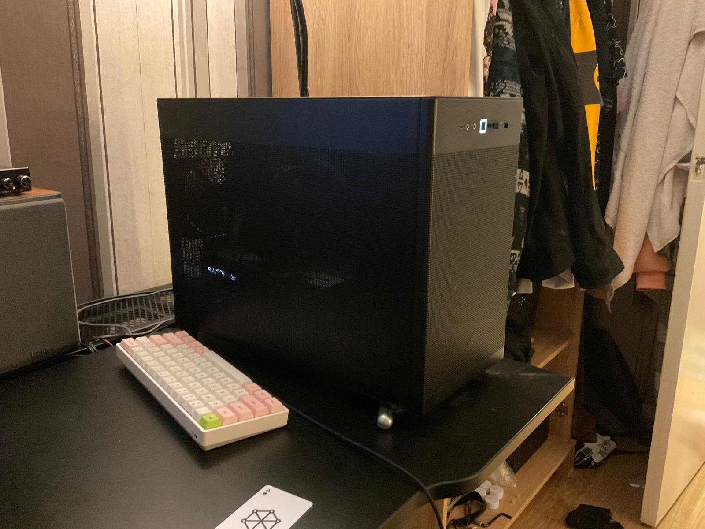

# Home Lab Server

Not actual build inside because old picture, I'm reusing the case
## System Specifications
- X99 Fata1ity Killer AsRock LGA2011
  - 16 x 4 GB DDR4 2133MHz
  - Intel Xeon E5-2699 V4 22 Core @ 2.20GHz HyperV enabled
  - No dGPU
  - 512GB NVME OS SDD
- SATA
 - 4 x 1TB RAID HDD

